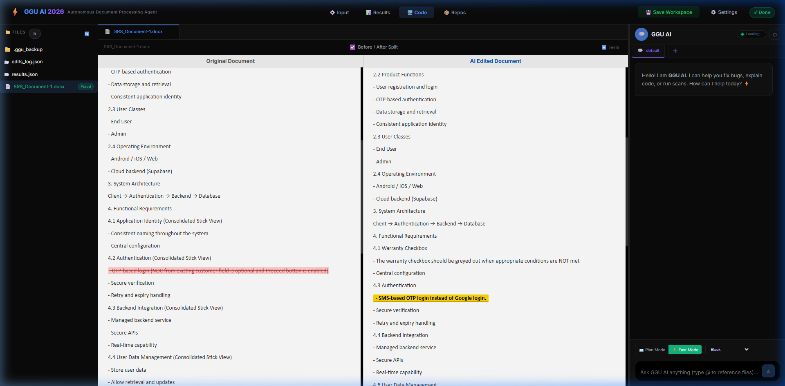

# 📄 GGU AI – Autonomous Word Document Processing Agent

<p align="center">
  
  
  
  
  
</p>



> **Transform manual document editing into an automated, AI-driven workflow.** 
> The GGU AI Document Agent is a specialized suite that parses Excel bug lists, analyzes Word documents, and applies precise text/table fixes with professional-grade side-by-side verification.

---

## 🔥 Key Features

### 🤖 Intelligent Patching Engine
- **Precise Fragment Replacement**: Uses `python-docx` to target specific text fragments within paragraphs and tables without losing formatting.
- **Structural Integrity**: Maintains document headers, numbering (e.g., 4.2 stays 4.2), and overall hierarchy through specialized LLM guidance.
- **Table Support**: Automatically finds and repairs content inside complex Word tables using row/column addressing.

### 📊 Professional Diff Viewer
- **Symmetrical Highlighting**: See exactly what changed in a high-fidelity split-pane view.
    - **Original (Left)**: ~~Red strike-through~~ for removed content.
    - **AI Edited (Right)**: **Gold background** for new fixes.
- **Transient Markers**: Highlighting is generated in-memory. Your original `.docx` files stay 100% clean and marker-free!

### ⚙️ Automated Workflow
- **Excel Batching**: Process hundreds of rows from a single `.xlsx` file across multiple Word documents in one go.
- **Real-time Status**: Live terminal output showing analysis progress, LLM decisions, and applied fix IDs.
- **Automatic Backups**: Every document is automatically backed up to `.ggu_backup/` before the first edit.

---

## 🚀 Quick Start (Development Mode)

### 1. Backend (Python)
```bash
cd backend
python -m venv .venv
.\.venv\Scripts\activate
pip install -r requirements.txt
python main.py
```

### 2. Frontend (React)
```bash
cd frontend-react
npm install
npm start
# → http://localhost:3000
```

---

## 📦 Production Build
To generate a standalone Windows installer:
```powershell
.\build_integrated_app.bat
```
Output: `electron-app\dist\GGU AI Document Processing Agent Setup 1.1.0.exe`

---

## 📜 License
Distributed under the **MIT License**. © 2026 Crafted by GGU AI.
